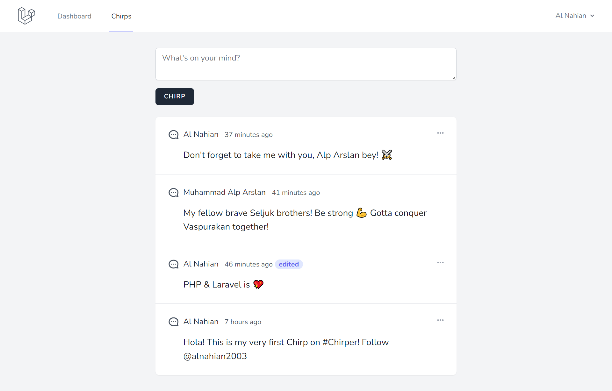

# Chirper — Laravel Bootcamp Project

This simple project completed within an hour. It was fun building a simple CRUD laravel app with a bit tricky difficult Notification/Events stuff.

## How To Use

1. Clone this repository

```bash
git clone https://github.com/alnahian2003/chirper.git
```

2. Switch to the repo folder

```bash
cd larajobs
```

3. Install all the dependencies using composer and npm

```bash
composer install
npm install
```

4. Copy the example env file and make the required configuration changes in the `.env` file

```bash
cp .env.example .env
```

5. Generate a new application key

```bash
php artisan key:generate
```

6. Run the database migrations (Set the database connection in `.env` before migrating)

```bash
php artisan migrate
```

7. Start the local development server

```bash
php artisan serve
```

8. Start Vite for bundling the assets (required)

```bash
npm run dev
```

You can now access the server at

```bash
http://localhost:8000 | OR | http://127.0.0.1:8000

```
